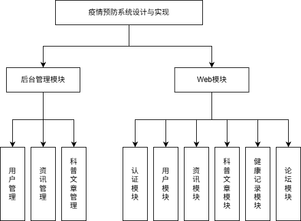
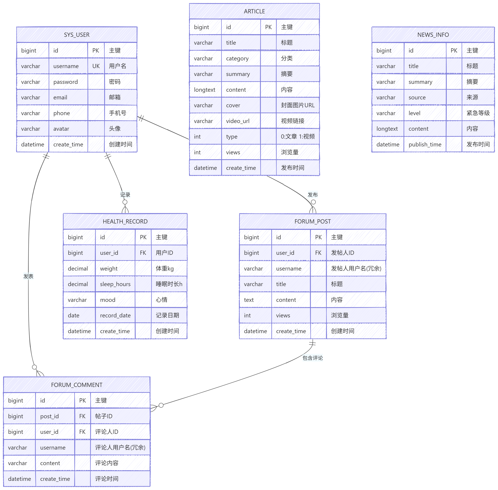
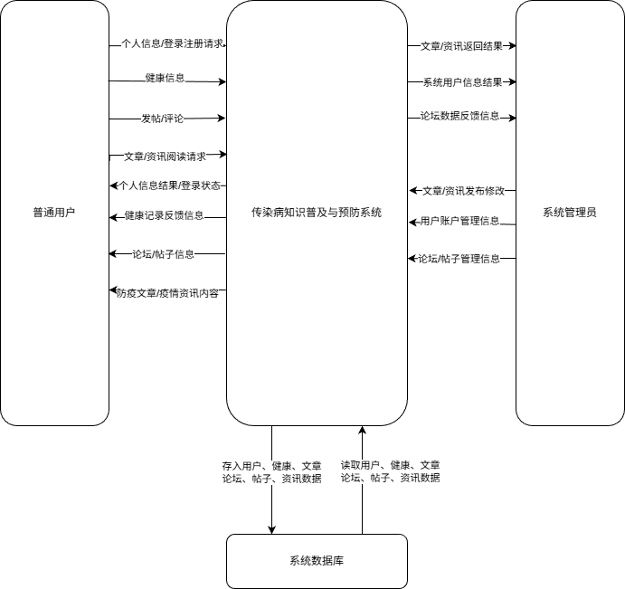
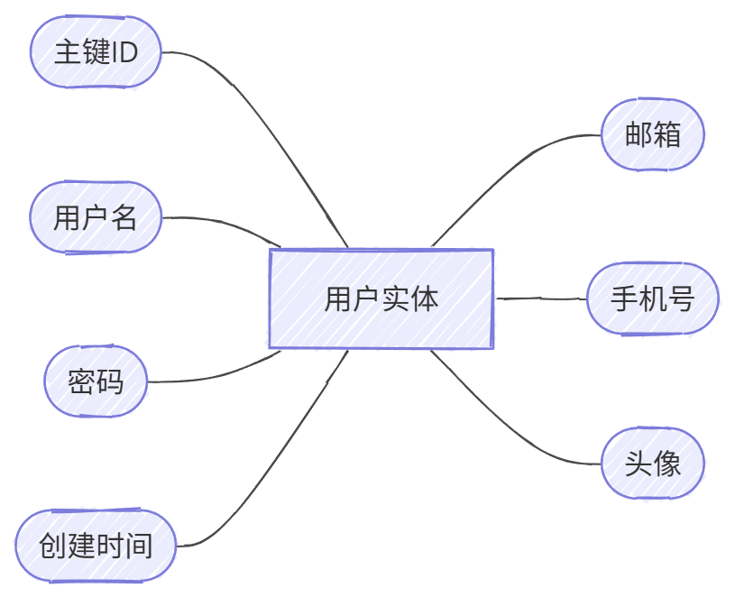
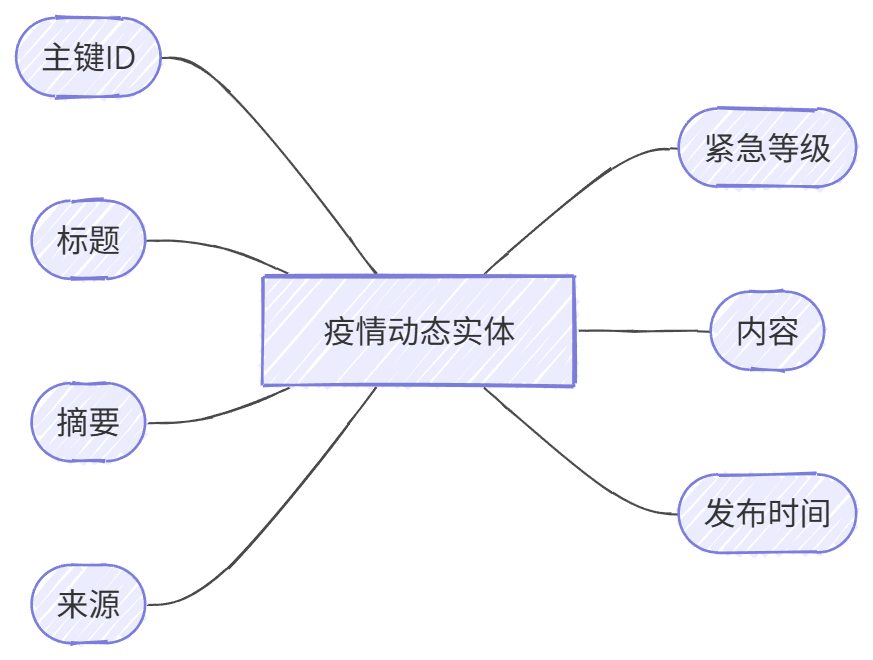
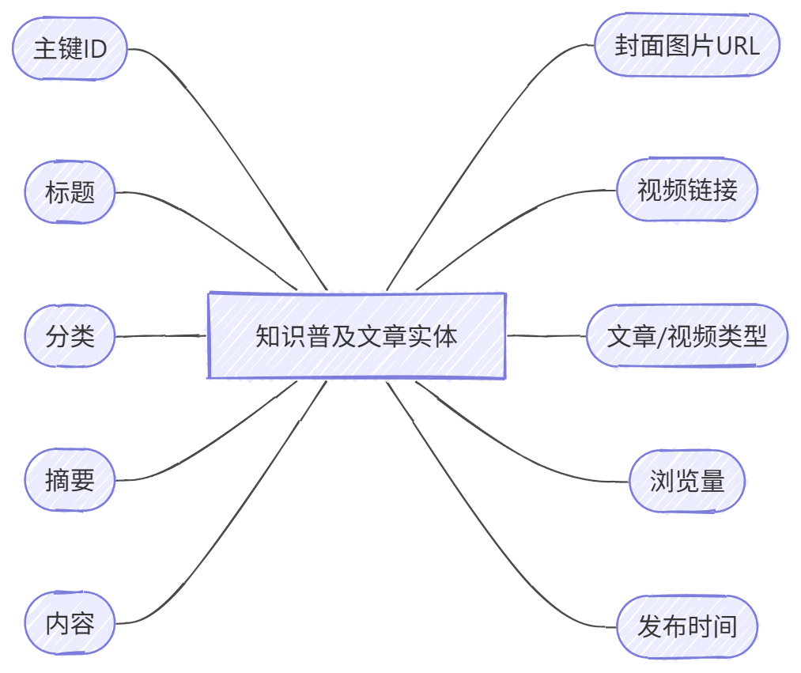
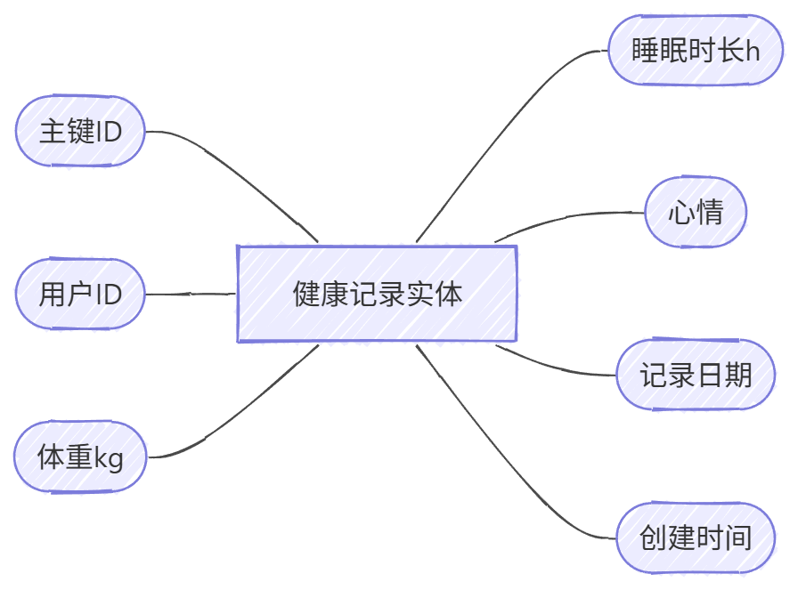
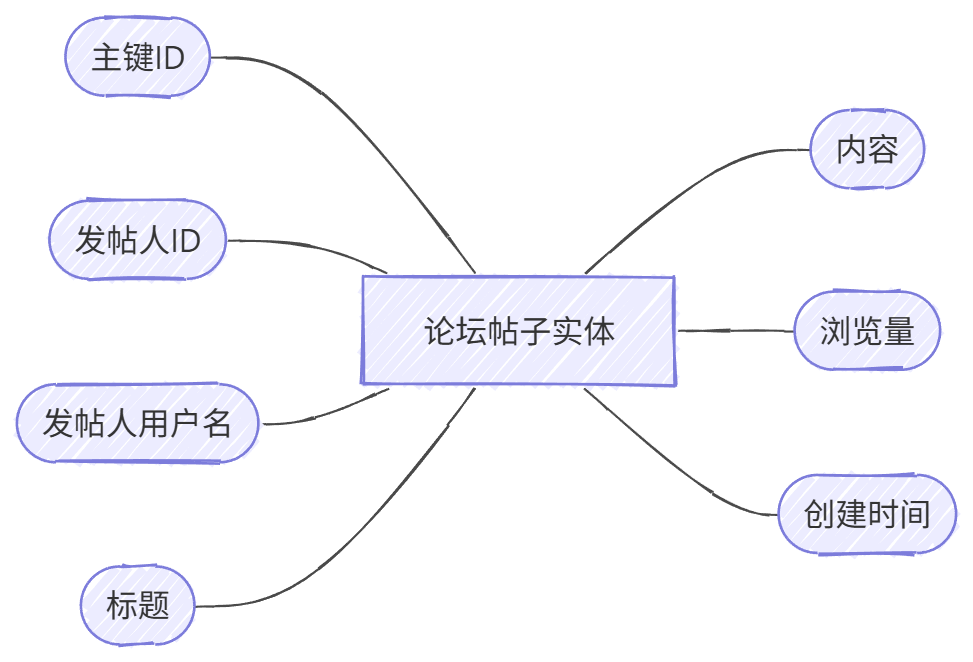

内蒙古工业大学本科生毕业设计(论文)开题报告
学生姓名		学   号		班   级	
指导教师	刘春雷	职   称	工程师
	郭全友		高级工程师
题目名称	基于Spring Boot的传染病宣传预防系统设计与实现
课题类型	毕业设计
一、题目目的：
传染病是指由各种致病性微生物或寄生虫引起的、能在人与人、动物与动物或人与动物之间相互传染的疾病。预防和控制传染病的发生和流行，对于保障公众身体健康和生命安全至关重要。传统的传染病管理往往侧重于事后响应与救治，而突发公共卫生事件给全社会敲响了警钟，国家卫生健康委员会倡导大家，要从以“疾病”为中心向以“健康”为中心转变，从注重“治已病”向注重“治未病”转变[1]。与此同时，养成良好、卫生的生活方式需要持续的宣传教育与日常健康监测。这意味着为公众提供一个集知识普及、疫情动态追踪和个人健康追踪于一体的综合预防管理系统是非常必要的[5]。
传染病宣传预防系统的建立是基于政府推动公共卫生应急管理体系改革和“互联网+医疗健康”建设的背景下，以及公众对自身健康和防病防灾日益增长的关注[4]。该系统主要针对普通民众及社区健康管理者，通过统一的平台整合零散的疫情资讯和防病知识资源，构建一体化的信息共享平台和科学规范的宣教体系，有效提升卫生信息资源价值。健康中国行动(2019—2030年)的基本路径中强调了提供系统连续的一体化健康服务，实现早预防、早发现、早干预的重要性[2]。因此，利用互联网和信息化手段是促进传染病预防事业发展的必然要求。

二、题目意义：
随着社会经济的快速发展和人口流动性的增强，传染病防控越来越受到人们的重视，已经成为预防突发公共卫生事件的重要措施，也为开展公众健康教育提供了新的途径。随着人们对自身及家庭健康重视程度的不断提高，无论是医疗卫生机构的宣教部门，还是普通民众，对全面、及时、准确的传染病资讯及预防知识的需求均不断增长[3]。同时国家卫生健康委员会强调加快公共卫生信息化建设的重要性，促使各级医疗机构和社区采用现代信息技术优化健康管理服务[6]。因此，研究设计并实现传染病宣传预防系统，为广大民众、社区工作者和平台管理者提供方便、快捷、更有价值的服务，成为目前的重要工作和任务。

传染病宣传预防系统的设计与实现响应了国家对突发公共卫生事件应急能力和健康信息化建设的需求，特别是在全球公共卫生形势复杂多变和公众防病意识增强的背景下[8]。该系统利用互联网技术，旨在优化健康宣教流程，提升信息获取效率，降低宣传成本，并规范健康数据的收集与管理[7]。同时，系统为用户提供了便捷的健康记录、抗疫动态掌握以及在线互动互助的平台，推动传染病预防服务向现代化和信息化发展[9]。

本系统采用浏览器/服务器（B/S）架构，核心应用基于SpringBoot和Vue框架，实现前后端分离与组件化开发。这种架构提升了系统的灵活性和可维护性，允许管理端和用户端独立开发与部署。管理端提供了一个全面的后台管理平台，涵盖系统配置、用户管理、疫情动态发布、知识普及文章管理、健康打卡记录核查及论坛社区管理等关键功能，强调数据安全、操作便捷和系统稳定性，以确保管理业务流程的高效和有序。用户端以Web网站形式提供服务，通过在线浏览资讯、阅读防病文章、每日健康填报打卡和论坛发帖交流等功能，实现了个性化和自助化的服务，使用户能够轻松掌握防病动态和自身健康状况。系统运行在Windows操作系统、MySQL数据库和Tomcat应用服务器上，确保了在多种环境下的高效运行。通过这种架构和技术选择，传染病宣传预防系统提供了一个高效、安全、用户友好的服务解决方案，满足了全社会对传染病预防信息化、规范化和常态化管理的需求[10]。

本系统致力于构建一个公开透明的健康宣传预防服务平台，通过数字化融合的服务模式，推动预防宣教与健康管理的协同发展。系统整合了传染病预防领域的知识资源，使民众能够随时随地通过手机或电脑查询防病信息，不受时间和地点的限制。此外，系统辅助管理人员高效管理疫情数据发布展示、用户状态信息和社区交流内容。

本系统充分发挥互联网的优势，不仅满足了用户随时随地获取防疫知识的需求，还可以自主记录和分析个人的健康状况。该系统的开发与应用有助于提升广大民众的健康防范意识和自救能力，促进其在日常生活中逐步积累疾病预防的知识与技能。从社会角度来看，这一系统有利于优化卫生宣传资源的配置，提高公众的防病水平，并推动社会的稳定与可持续发展。

三、设计（研究）主要内容及方案：
本题目应完成基于SpringBoot的传染病宣传预防系统的需求分析、设计与实现，并撰写毕业设计说明书。系统主要功能模块应包括但不限于如下内容：
1.用户模块：
1）用户注册/登录：普通用户及管理员可以通过账号密码进行注册和登录，系统具备完善的安全认证机制。
2）个人中心：登录后，用户进入个人中心，可以查看和管理自己的账户信息、修改密码。
3）信息管理：用户可以查看和编辑自己的基本资料，如姓名、性别、手机号、邮箱等。
2.疫情动态与知识模块：
1）疫情动态查看：用户可以浏览系统发布的最新疫情动态、政策法规和新闻，了解目前的卫生防病形势。
2）知识普及阅读：系统提供丰富的传染病预防知识和科普文章，用户可在线进行阅读学习。
3）内容管理：拥有权限的管理员可在后台实现对这些文章和疫情信息的发布、修改、下架及删除操作。
3.健康记录模块：
1）健康打卡填报：用户可每日录入自己的体温、异常症状表现等健康信息。
2）历史记录查询与监控：用户可以查询自己的历史健康填报数据；管理员可以在后台全景式查看用户的填报状态，并筛选出可能存在健康风险的异常记录加以关注。
4.论坛交流模块：
1）发帖互动：为用户提供一个在线交流社区，用户可以在此分享防疫防病经验、提出疑问。
2）评论交流：支持在别人的帖子下进行留言、回复讨论。
3）帖文管理：管理员对论坛内不合规的帖子或评论进行审核与删除，维护健康的网络交流环境。
5.组织管理模块：
1）角色与权限配置：系统提供包含管理员、普通用户等不同角色的配置与管理，每个角色有自己独立的权限视图。
2）用户统筹管理：系统管理员对平台上注册的所有用户进行管控，包括账号启用、停用及信息变更。

四、系统模块图：
本系统是一个双端的传染病宣传预防系统，用户在前台系统中可以修改个人信息，查看疫情动态与知识文章，进行健康记录的打卡填报，并在论坛中发帖交流。后台系统中，管理员负责对系统中所有的用户信息、新闻公告、防病知识、用户健康状态以及论坛内容进行统筹和管理。

图1 系统模块图

五、系统E-R图：

图2 系统E-R图

六、顶层数据流图

图3 顶层数据流图

七、实体属性图

图4 用户实体属性图

图5 疫情动态实体属性图

图6 知识普及文章实体属性图

图7 健康记录实体属性图

图8 论坛帖子实体属性图

八、数据字典
(1) 用户：
表1 用户数据字典
序号	字段名称	字段类型	允许为空	最大长度	备注
1	用户ID	INT	否	11	主键，自增
2	用户名	VARCHAR	否	50	登录账号
3	密码	VARCHAR	否	255	加密后的登录密码
4	手机号	VARCHAR	是	11	联系电话
5	邮箱	VARCHAR	是	100	用户邮箱
6	账号状态	TINYINT	否	1	表示正常或冻结

(2) 疫情动态：
表2 疫情动态数据字典
序号	字段名称	字段类型	允许为空	最大长度	备注
1	动态ID	INT	否	11	主键，自增
2	动态标题	VARCHAR	否	100	疫情动态的新闻标题
3	文章内容	TEXT	是	-	动态详细内容
4	发布日期	DATETIME	否	-	发布该动态的时间
5	展示状态	TINYINT	否	1	是否展示，1为显示，0为隐藏

(3) 健康记录：
表3 健康记录数据字典
序号	字段名称	字段类型	允许为空	最大长度	备注
1	记录ID	INT	否	11	主键，自增
2	用户ID	INT	否	11	外键，关联用户表
3	体温	DECIMAL	否	10	用户的当前体温，单位：摄氏度
4	异常症状	VARCHAR	是	255	是否有咳嗽、发热等症状描述
5	打卡时间	DATETIME	否	-	提交记录的时间戳

(4) 论坛帖子：
表4 论坛帖子数据字典
序号	字段名称	字段类型	允许为空	最大长度	备注
1	帖子ID	INT	否	11	主键，自增
2	发帖人ID	INT	否	11	外键，关联用户表
3	帖子标题	VARCHAR	否	100	论坛帖子的标题
4	帖子内容	TEXT	否	-	帖子的详细文本内容
5	发布时间	DATETIME	否	-	发布该帖子的时间
6	浏览量	INT	是	11	该帖子的热度或点击次数

九、创新之处
(1) 将传染病信息传导与常态化的防病知识科普相结合：突破了传统疾控宣传过度侧重单向发布的弊端，允许用户在一个直观的在线服务平台上同时获取宏观的疫情动态和微观的防护技能，解决了防病宣教信息过于碎片化的问题。
(2) 融合了主动预防与个人自我监测机制：除了提供图文并茂的科普资讯外，系统加入了“健康记录”每日打卡机制，让个体能数字化追踪自身每天的体征情况，实现了“知、信、行”合一的预防闭环。通过配套的社区论坛，进一步促进了用户间相互分享与互助交流。

十、参考文献
[1] 赵自雄. 我国传染病监测信息系统发展与整合建设构想[J]. 中国公共卫生管理, 2020.
[2] 胡艺铭. 我国传染病监测系统有效利用程度分析[D]. 中国疾病预防控制中心, 2019.
[3] 林梦宣. 基于互联网大数据的传染病预测预警研究进展[J]. 中国医学科学院学报, 2021.
[4] 刘民. 重大突发传染病智能化主动监测预警系统设计研究[J]. 卫生研究, 2020.
[5] 邓源. 大数据在传染病监测预警中的主要研究与应用进展[J]. 中华预防医学杂志, 2021.
[6] 李琦. 城市突发公共卫生事件应急指挥系统空间数据模型设计——以“合肥地区非典防治决策支持系统”为例[J]. 遥感学报, 2004.
[7] 张新雷. 传染病现场防控装备效能评估系统设计与实现[D]. 军事科学院, 2019.
[8] 赵瑞. 新冠疫情下社区人员管理系统的设计与实现[D]. 西安电子科技大学, 2020.
[9] 肖永平. 疫情监测与上报管理系统的设计与实现[D]. 大连理工大学, 2021.
[10] 叶俊. 基于区域性的嵌入式传染病上报系统的设计与应用[J]. 计算机测量与控制, 2020.

工作进度安排（具体）：
1）第1-2周，需求分析与软件设计，撰写需求分析报告、软件设计报告、开题报告，开题报告完成后，学院组织开题答辩。
2）第3-8周，原型系统开发、测试、调试。每周进行进度汇报、系统演示；8周末学院组织中期答辩，检查毕业设计进展情况，达不到计划进度的不能按期参加毕业答辩。
3）第9-12周，撰写毕业设计说明书，11周末提交毕业设计说明书初稿，12周末提交毕业设计说明书终稿，学校组织电检查重。
4）第13周，指导老师，评阅人审阅对毕业设计说明书进行互评，学生修改说明书，13周末提交毕业设计说明书修改稿。
5）第14周，毕业答辩。14周末提交毕业设计说明书最终修改稿，学校组织再次查重。

指导教师意见：
              指导教师签名：                 
                                                 年     月     日
